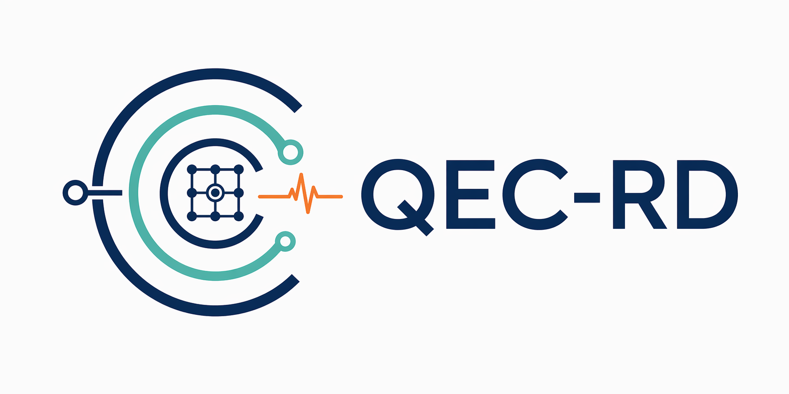

# QEC-RD-Software

<p align="center">
  
</p>

[](https://github.com/QuAIR/QEC-RD-Software/actions/workflows/ci.yml)
[](https://github.com/QuAIR/QEC-RD-Software/actions/workflows/coverage.yml)
[](https://codecov.io/gh/QuAIR/QEC-RD-Software)
[](https://github.com/QuAIR/QEC-RD-Software/actions/workflows/docs.yml)

QEC-RD-Software is a local research and engineering backbone for quantum error correction (QEC). It connects circuit construction, detector-error-model (DEM) extraction, syndrome sampling, decoding, and analysis behind a small Python API.

Stage 1 is intentionally focused: `stim` is the only runtime backend, DEM/graph logic is platform-owned, non-Pauli runtime noise is out of scope, and decoders come from external packages or custom decoder hooks.

## Why This Repo Exists

Many QEC experiments start as separate scripts: one script builds a circuit, another extracts a DEM, another runs a decoder, and another analyzes logical failures. This project turns that workflow into a stable object chain:

`CodeSpec -> CircuitArtifact -> DemArtifact -> DecodingGraph -> SyndromeBatch -> DecodeResult -> AnalysisReport`

That object chain is the shared language for users, researchers, and future engineering contributors.

## Main Features

- Built-in circuit catalog for repetition, rotated surface, unrotated surface, and toric memory experiments.
- Circuit import path for user-provided `stim.Circuit` objects or `.stim` files.
- Fixed DEM extraction and decoding-graph construction owned by the platform.
- Stim-based syndrome sampling normalized into `SyndromeBatch`.
- Stim-executable Pauli-style noise presets, including toy, toy phenomenological, SD6, scheduled SI1000-style, and coarse circuit-level SI1000-style models.
- External MWPM decoding through `pymatching`.
- Custom decoder hooks that return the same `DecodeResult` shape.
- Analysis reports with logical error rate, failure counts, and per-logical summaries.

## Install

From the repository root:

```powershell
python -m pip install --upgrade pip
python -m pip install -e ".[dev,docs]"
```

If you only want to run the package without docs tooling:

```powershell
python -m pip install -e ".[dev]"
```

## First Experiment

This runs a complete built-in repetition-code memory experiment with MWPM decoding:

```python
from qec_rd.api import CodeSpec, ExperimentConfig, NoiseModel, run_experiment

config = ExperimentConfig(
    code_spec=CodeSpec(
        family="repetition_code:memory",
        distance=3,
        rounds=3,
        logical_basis="Z",
    ),
    noise_spec=NoiseModel(after_clifford_depolarization=0.001),
    decoder_spec={"name": "pymatching"},
    sim_spec={"shots": 100, "seed": 7},
)

result = run_experiment(config)

print(result.analysis_report.shot_count)
print(result.analysis_report.logical_error_rate)
```

## End-to-End Demos

The docs include five acceptance demos that validate the design:

- [Built-in repetition memory experiment](docs/demos/builtin-repetition-memory.md)
- [Rotated surface memory with scheduled SI1000-style noise](docs/demos/rotated-surface-si1000.md)
- [Imported Stim circuit pipeline](docs/demos/imported-stim-circuit.md)
- [Custom decoder hook](docs/demos/custom-decoder-hook.md)
- [Parameter sweep and analysis report](docs/demos/sweep-analysis-report.md)

Build the docs locally with:

```powershell
mkdocs build --strict
```

## Public API Map

Most users should start from `qec_rd.api`:

```python
from qec_rd.api import (
    CodeSpec,
    ExperimentConfig,
    NoiseModel,
    build_circuit,
    extract_dem,
    build_decoding_graph,
    sample_syndromes,
    run_decoder,
    analyze_results,
    run_experiment,
    sweep,
)
```

The direct pipeline API is useful when you want to inspect each artifact. The runner API is useful when you want a compact experiment configuration.

## Development Workflow

Run the test suite:

```powershell
pytest -q
```

Run the coverage gate:

```powershell
pytest --cov=qec_rd --cov-report=term-missing --cov-report=xml -q
```

Build docs:

```powershell
mkdocs build --strict
```

The repository has three GitHub Actions workflows:

- `.github/workflows/ci.yml` for tests
- `.github/workflows/coverage.yml` for coverage and Codecov upload
- `.github/workflows/docs.yml` for documentation builds

## Contributor Orientation

Before changing architecture or public behavior, read:

- [AGENTS.md](AGENTS.md) for agent and contributor rules
- [CODEX.md](CODEX.md) for the working contract
- [Stage 1 backbone design](docs/superpowers/specs/2026-04-20-qec-rd-platform-backbone-design-en.md)
- [Three-person execution plan](docs/superpowers/plans/2026-04-21-qec-rd-stage1-3person-execution.md)

Keep Stage 1 changes small and testable. Do not add non-Pauli runtime behavior, do not make DEM/graph construction user-customizable, and do not reimplement external decoders inside this repo.

## Current Limitations

- Runtime backend is `stim` only.
- Surface and toric circuits are platform-owned Stage 1 implementations.
- DEM and graph behavior are fixed in Stage 1.
- Non-Pauli noise and leakage are outside Stage 1 runtime scope.
- Codecov requires repository token/OIDC configuration before the external Codecov badge can show uploaded coverage.

## Team

- [shunzgim](https://github.com/shunzgim)
- [Chriskmh](https://github.com/Chriskmh)
- [LeiZhang-116-4](https://github.com/LeiZhang-116-4)

## License

This project is licensed under the Apache License 2.0.

See [LICENSE](LICENSE) for the full text and [NOTICE](NOTICE) for attribution details.
