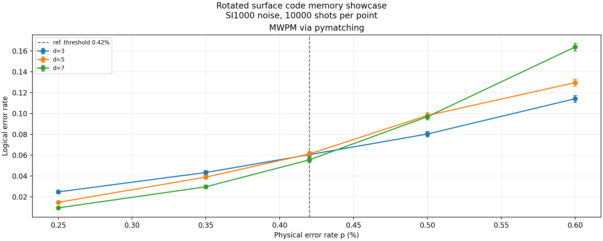

# Acceptance Showcase

This is the heavier Stage 1 acceptance-oriented demo for QEC-RD-Software.
It is designed to exercise more of the backbone than the quick default demo:

- built-in `rotated_surface_code`
- scheduled `si1000` noise
- `pymatching` MWPM decoding
- multiple code distances `d = 3, 5, 7`
- threshold-style logical-error-rate sweep

## Why This Is Separate

The default evaluation demo stays fast:

```powershell
python -m qec_rd.demo
```

This acceptance showcase is intentionally heavier and is meant to generate review assets:

```powershell
python -m qec_rd.showcase
```

Or, after editable install:

```powershell
qec-rd-showcase
```

## What It Generates

By default the generator writes three files under `docs/demos/assets/`:

- `rotated_surface_si1000_threshold_showcase.csv`
- `rotated_surface_si1000_threshold_showcase.json`
- `rotated_surface_si1000_threshold_showcase.png`

The sweep parameters are:

- distances: `3, 5, 7`
- decoder: `pymatching`
- physical error rates: `0.25%`, `0.35%`, `0.42%`, `0.50%`, `0.60%`
- shots per point: `10000`

## Result



The figure shows the logical error rate versus physical error rate for three distances.
The reference threshold line at `p = 0.42%` illustrates the crossing behavior expected
from a well-behaved surface code memory experiment under circuit-level noise.

## Raw Data

The full numeric results are available in:

- [CSV](assets/rotated_surface_si1000_threshold_showcase.csv)
- [JSON](assets/rotated_surface_si1000_threshold_showcase.json)
